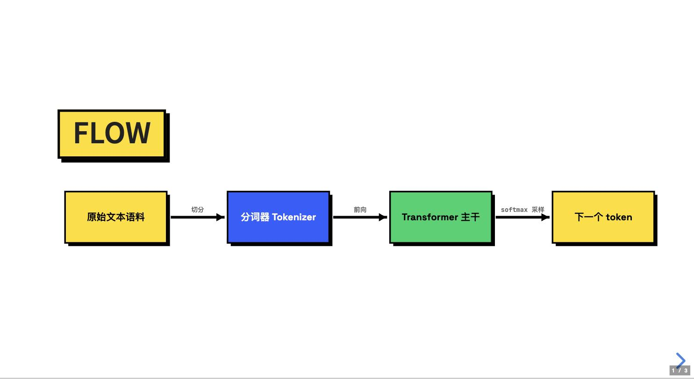
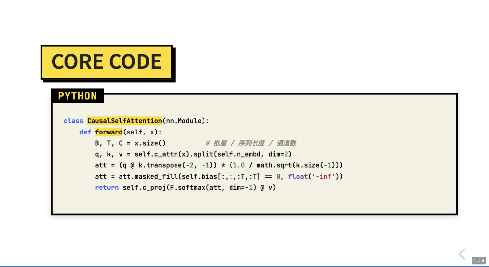

# repo-explainer

一个 Claude Code Skill，将任意 GitHub 开源仓库转化为 **Neobrutalism 风格的交互式幻灯片**，用小白友好的方式讲解仓库做什么、怎么做、核心概念。

A Claude Code Skill that turns any GitHub repository into **Neobrutalism-style interactive slides** — explaining what it does, how it works, and its core concepts in a beginner-friendly way.

<p align="center">
  
  
  
  
</p>

## 快速开始 / Quick Start

**两步搞定 / Two steps:**

```bash
npx skills add Trentct/repo-explainer
```

就这一行。会自动检测你在用的 agent（Claude Code / Codex / …）并装到对应位置。
加 `-g` 装到全局，加 `-a '*'` 装到所有已检测到的 agent。

That's the whole install. It auto-detects your agent (Claude Code / Codex / …) and installs to the right place.
Add `-g` for global, `-a '*'` for every detected agent.

> **唯一的依赖 DeepWiki MCP 不用你操心**——第一次使用时 skill 会自己检测、帮你装好并告诉你重启。
> 想手动装或者想知道它改了什么，见下面的[安装](#安装--installation)一节。
>
> **The one dependency, DeepWiki MCP, installs itself** — on first use the skill detects it's missing, sets it up, and tells you to restart. See [Installation](#安装--installation) to do it by hand.

**然后重启会话，在对话里说 / Then restart your session and say:**

```
讲解仓库 https://github.com/karpathy/nanogpt
```

就这样。/ That's it.

---

## 效果预览 / Preview

<p align="center">
  
  
</p>

生成的幻灯片具有以下特点：

- **Neobrutalism 视觉语言** — 纯黑粗边框、硬投影（`8px 8px 0 #000`）、零圆角、荧光色块
- **纯 SVG 硬边图表** — 所有架构图、流程图用几何 helper 程序化绘制，raw & honest
- **四色高饱和体系** — 黄 `#FFDD00` / 蓝 `#2E5EFF` / 粉 `#FF3D7F` / 绿 `#00D26A`
- **全大写 display 字体** — Archivo Black 做标题，Space Grotesk 做正文，JetBrains Mono 做代码
- **单文件自包含** — 一个 HTML 文件，浏览器直接打开
- **交互式演示** — 基于 reveal.js，支持翻页、全屏、演讲者视图

The generated slides feature:

- **Neobrutalism visual language** — thick black borders, hard offset shadows (`8px 8px 0 #000`), zero radius, fluorescent color blocks
- **Pure SVG hard-edge diagrams** — all architecture & flow diagrams drawn programmatically with geometric helpers, raw & honest
- **Four-color high-saturation system** — yellow / blue / pink / green
- **All-caps display typography** — Archivo Black for headings, Space Grotesk for body, JetBrains Mono for code
- **Self-contained single file** — one HTML file, open directly in browser
- **Interactive presentation** — powered by reveal.js with navigation, fullscreen, and speaker view

## 安装 / Installation

### 前置要求 / Prerequisites

- [Claude Code](https://docs.anthropic.com/en/docs/claude-code) CLI ≥ 最近版本
- **DeepWiki MCP**（官方，由 Cognition 托管） — 用于结构化抽取 GitHub 仓库信息 / for fetching structured repo information

### Step 1 — 安装 DeepWiki MCP / Install DeepWiki MCP

本 skill 强依赖 [DeepWiki MCP](https://mcp.deepwiki.com)。任选一种方式：

Endpoint 统一是 `https://mcp.deepwiki.com/mcp`（streamable HTTP，无需本地进程、不用 API key）。按你用的工具选一种：

The endpoint is always `https://mcp.deepwiki.com/mcp` (streamable HTTP, no local process, no API key). Pick the one matching your tool:

**Claude Code:**

```bash
claude mcp add --transport http deepwiki https://mcp.deepwiki.com/mcp
claude mcp list          # 应该看到 deepwiki ✓ Connected
```

**Codex** — 在 `~/.codex/config.toml` 末尾追加 / append to `~/.codex/config.toml`:

```toml
[mcp_servers.deepwiki]
url = "https://mcp.deepwiki.com/mcp"
```

**手动编辑（Claude Code）/ Manual config** — 编辑 `~/.claude.json` 或项目的 `.mcp.json`：

```json
{
  "mcpServers": {
    "deepwiki": { "type": "http", "url": "https://mcp.deepwiki.com/mcp" }
  }
}
```

**其他 harness / Other harnesses** — 用同一个 endpoint，按各自的 MCP 配置方式加即可。

装完**需要重启会话** MCP 才会加载。如果工具未就绪，本 skill 会在 Step 0 检查、帮你装并说明怎么继续。

Restart your session after installing — MCP servers load at startup. If the tools aren't ready, the skill detects it in Step 0, installs it for you, and tells you how to resume.

> ⚠️ DeepWiki 只索引**公开 GitHub 仓库**。私有仓库需用 DeepWiki 付费版（Devin）。
> ⚠️ DeepWiki indexes **public GitHub repos only**. Private repos require DeepWiki paid tier (Devin).

### Step 2 — 安装 Skill / Install the Skill

**推荐 / Recommended:**

```bash
npx skills add Trentct/repo-explainer
```

自动检测 agent 并安装。常用参数：`-g` 全局、`-a '*'` 装到所有 agent、`-y` 跳过确认、`-l` 只列出不安装。

Auto-detects your agent. Handy flags: `-g` global, `-a '*'` all agents, `-y` skip prompts, `-l` list only.

**手动 / Manual** — 直接 clone 到对应目录也行：

```bash
# Claude Code
git clone https://github.com/Trentct/repo-explainer ~/.claude/skills/repo-explainer

# Codex
git clone https://github.com/Trentct/repo-explainer ~/.codex/skills/repo-explainer
```

重启会话，skill 即可被自动加载（两边都走 `skills/{name}/SKILL.md` 约定）。

Restart your session; the skill loads automatically (both tools use the `skills/{name}/SKILL.md` convention).

**验证装好了 / Verify the install** — 在 Claude Code 里输入 `/` ，列表里能看到 `repo-explainer` 就成了。或者直接发一句 `讲解仓库 karpathy/nanoGPT` 试跑。

Type `/` in Claude Code — if `repo-explainer` shows up in the list, you're set. Or just try `explain repo karpathy/nanoGPT`.

### 升级 / Upgrade

```bash
npx skills update repo-explainer      # 用 skills 装的
cd ~/.claude/skills/repo-explainer && git pull   # 手动 clone 的
```

## 使用方法 / Usage

在 Claude Code 中使用以下任一方式触发：

Trigger in Claude Code with any of the following:

```
/repo-explainer https://github.com/karpathy/nanochat

/repo-explainer owner/repo

讲解仓库 https://github.com/NousResearch/hermes-agent
```

### 参数 / Parameters

| 参数 Parameter | 说明 Description | 默认值 Default |
|---|---|---|
| 语言 Language | 中文 / English / 其他 | **跟随你说话的语言** Follows your prompt language |
| 深度 Depth | 快速 Quick (~8p) / 标准 Standard (~15p) / 深入 Deep (~25p) | 标准 Standard |
| 聚焦 Focus | 指定模块 Specific module | 全部 All |

### 示例 / Examples

```
# 标准讲解 / Standard explanation
/repo-explainer https://github.com/karpathy/nanochat

# 语言默认跟随你说话的语言，也可显式指定
# Language follows your prompt by default; override explicitly if needed
/repo-explainer https://github.com/karpathy/nanochat 用英文做
explain repo https://github.com/karpathy/nanochat

# 快速概览 / Quick overview
/repo-explainer https://github.com/karpathy/nanochat 快速

# 聚焦模块 / Focus on module
/repo-explainer https://github.com/karpathy/nanochat 只讲训练部分
```

### 输出位置 / Output location

默认写到**当前工作目录**；如果存在 `docs/slides/` 或 `slides/` 就写进去。想固定到别的位置，在项目根目录放一个 `.repo-explainer.json`：

Defaults to the **current working directory**, or `docs/slides/` / `slides/` if either exists. To pin it elsewhere, drop a `.repo-explainer.json` in your project root:

```json
{ "outDir": "docs/slides" }
```

文件名跟随输出语言：中文 `{repo}-讲解.html`，其他语言 `{repo}-slides.html`。

## 常见问题 / Troubleshooting

**「这个仓库 DeepWiki 没索引过」** — DeepWiki 只对已索引的仓库有数据。打开 `https://deepwiki.com/{owner}/{repo}` 点一下索引，几分钟后重试。私有仓库需要 DeepWiki 付费版。

*DeepWiki only has data for repos it has indexed. Visit `https://deepwiki.com/{owner}/{repo}` to trigger indexing, wait a few minutes, retry. Private repos need the paid tier.*

**幻灯片打开是一坨堆叠的裸文本** — reveal.js 的 CDN 没连上。模板会自动依次尝试 jsDelivr → Fastly → unpkg，三个都失败时会显示提示横幅。中国大陆用户挂个代理刷新即可。

*The reveal.js CDN didn't load. The template falls back jsDelivr → Fastly → unpkg and shows a banner if all three fail. Behind the GFW, use a proxy and refresh.*

**某页内容显示不全 / 被截断** — 画布固定 1280×760，超出部分会被静默截断。在 URL 后加 `?debug=1` 重新打开，溢出的页会被粉色虚线框标出来，然后让 Claude 把那几页拆开。

*The canvas is a fixed 1280×760 and overflow is silently clipped. Reopen with `?debug=1` appended to the URL — overflowing slides get a pink dashed outline. Then ask Claude to split them.*

**字体看起来不对** — Google Fonts 被墙时会回落到系统字体（PingFang SC / Microsoft YaHei）。版式还在，只是 display 字体没那么冲。

*When Google Fonts is blocked, the stack falls back to system fonts. Layout survives; the display face is just less punchy.*

## 设计系统 / Design System

### 色彩 / Colors

| 角色 Role | 颜色 Color | 用途 Usage |
|---|---|---|
| 🟡 Yellow | `#FFDD00` | 主强调 / 高亮块 / Primary accent, highlights |
| 🔵 Blue | `#2E5EFF` | 次强调 / 数据流 / Secondary, information blocks |
| 🌸 Pink | `#FF3D7F` | 警告 / 对比 / Warning, contrast, counter-examples |
| 🟢 Green | `#00D26A` | 正面结果 / Positive results, success state |
| ⚫ Black | `#000000` | 边框、箭头、投影 / Borders, arrows, shadows |
| 📄 Paper | `#FFFCF0` | 米白底色 / Background |

### 字体 / Fonts

| 字体 Font | 用途 Usage |
|---|---|
| Archivo Black | Display 标题（全大写） / Display headings (uppercase) |
| Space Grotesk | 正文 / Body text |
| JetBrains Mono | 代码 / 技术标签 / Code, technical labels |

### 组件 / Components

- **brutal-card** — 硬边卡片（黄/蓝/粉/绿/黑五色） / Hard-edged cards (5 color variants)
- **tilt-left / tilt-right** — 轻微旋转，强化 raw 感 / Slight rotation for raw feel
- **dialog-row** — 对话行（用户/反例/正例） / Dialog rows (user / bad / good)
- **grid-2/3/4** — 网格布局 / Grid layouts
- **tag** — 徽章标签 / Badge tags
- **step** — 大数字步骤块 / Numbered step blocks
- **marker** — 粉色标注 / Pink inline markers
- **stamp** — 倾斜黄色图章（CORE/NEW/HOT） / Tilted yellow stamp
- **big-num** — 超大数字展示 / Display-size numbers
- **blockquote** — 黑底白字大引用 / Black-background big statement

### SVG 图表 Helper / SVG Diagram Helpers

**Auto-layout（默认用这层，只给内容数组，坐标全自动）/ Auto-layout (preferred — pass content, coordinates are computed):**

| 函数 Function | 用途 Usage |
|---|---|
| `drawFlow(svg, items, opts)` | 横向流程 / 数据流 / Horizontal flow |
| `drawStack(svg, layers, opts)` | 竖向分层架构 / Vertical layered architecture |
| `drawGrid(svg, items, opts)` | 概念卡网格 / Concept card grid |
| `drawCompare(svg, left, right, opts)` | 左右对比 + VS / Side-by-side comparison |
| `drawTimeline(svg, nodes, opts)` | 时间线 / 学习路径 / Timeline, learning path |
| `diagram(id, fn)` · `autoFit(svg)` | 自动裁剪画布，杜绝画出边界 / Auto-fit viewBox |

自动处理：中英混排断行、装不下时缩字号、深色底自动配浅色字、三色轮转、画布裁剪。
Handles automatically: CJK/Latin line breaking, font auto-shrink, contrast-aware text color, 3-color rotation, viewBox cropping.

**底层图元 / Low-level primitives:**

| 函数 Function | 用途 Usage |
|---|---|
| `drawBox(svg, x, y, w, h, label, opts)` | 硬边矩形 + 硬投影 / Hard-edge rect with offset shadow |
| `drawArrow(svg, x1, y1, x2, y2, opts)` | 粗黑直线箭头 / Thick black arrow |
| `drawCircle(svg, cx, cy, d, label, opts)` | 硬边实心圆节点 / Solid circular node |
| `drawText / drawMono` | Space Grotesk / JetBrains Mono 文字 / Typography |
| `drawChip(svg, x, y, text, opts)` | 带阴影的徽章 / Badge with shadow |

## 设计风格固化 / Style is Hard-coded

本 skill 的 Neobrutalism 风格（色板、字体、组件、SVG helper）**写死在 `SKILL.md` 内**，与用户本地的 `CLAUDE.md` / 项目偏好**完全无关**。运行此 skill 总是产出统一的 brutalism 幻灯片——这是它的产品特征。如果你需要别的视觉风格，请 fork 后改 `SKILL.md` 的 CSS 段。

This skill's Neobrutalism style (palette, fonts, components, SVG helpers) is **hard-coded inside `SKILL.md`** and is **independent** of any local `CLAUDE.md` or project preferences. Running this skill always produces the same brutalism slides — that's the product. If you need a different look, fork and edit the CSS block in `SKILL.md`.

## 所需权限 / Required Tools

`SKILL.md` 在 frontmatter 中通过 `allowed-tools` 显式声明所需工具（Claude Code 的字段；Codex 会忽略它，不影响加载）：

The skill declares its required tools in frontmatter via `allowed-tools` (a Claude Code field; Codex ignores it harmlessly):

| 工具 / Tool | 用途 / Purpose |
|---|---|
| `mcp__deepwiki__read_wiki_structure` | 读取仓库目录 / Read repo wiki structure |
| `mcp__deepwiki__ask_question` | 针对性提问 / Targeted Q&A |
| `Read` | 读取本地文件（路径判定时偶尔需要）/ Read local files when probing output directory |
| `Write` | 写入生成的 HTML / Write the generated HTML |
| `Bash` | 平台检测（`uname -s`）、目录检测（`test -d`）/ Platform & directory detection |

## 工作原理 / How It Works

```
GitHub URL → DeepWiki API → 结构化问答 → reveal.js + 纯 SVG → 自包含 HTML
GitHub URL → DeepWiki API → Structured Q&A → reveal.js + Pure SVG → Self-contained HTML
```

1. **获取结构** — 通过 DeepWiki MCP 读取仓库文档结构
2. **针对性提问** — 3-5 次 ask_question 获取关键信息（一句话总结、核心概念、架构、使用场景）
3. **生成幻灯片** — 组织为 reveal.js 幻灯片 + 纯 SVG 硬边图表
4. **输出文件** — 从 `assets/template.html` 复制骨架、填入内容，写出单文件 HTML，做一次排版自检，再按平台给出打开命令

---

1. **Get structure** — Read repo documentation structure via DeepWiki MCP
2. **Targeted questions** — 3-5 ask_question calls to gather key info (one-liner, core concepts, architecture, use cases)
3. **Generate slides** — Organize into reveal.js slides + pure SVG hard-edge diagrams
4. **Output file** — Copy the skeleton from `assets/template.html`, fill in content, write one self-contained HTML file, run a layout self-check, and print the platform-specific open command

## 技术栈 / Tech Stack

- [reveal.js v5](https://revealjs.com/) — 幻灯片框架 / Presentation framework
- **Pure SVG + custom helpers** — 硬边几何图表，无图表库依赖 / Hard-edge geometric diagrams, no chart library
- [Google Fonts](https://fonts.google.com/) — Archivo Black / Space Grotesk / JetBrains Mono
- [DeepWiki MCP](https://mcp.deepwiki.com) — 仓库信息获取 / Repository information（官方，Cognition 托管）

## 设计原则 / Design Principles

Neobrutalism 不是装饰，是一套严格的视觉纪律：

1. **Raw, honest, 无装饰** — 不用渐变、半透明、阴影模糊
2. **硬边几何** — 所有边框 3-5px 纯黑，所有投影 `Xpx Xpx 0 #000`
3. **色块暴力对比** — 单图表最多 3 种高饱和色 + 黑白
4. **字号反差极端** — 标题 5-7em，正文 0.8em
5. **允许错位旋转** — 卡片可以 ±1.5deg 倾斜，强化"未打磨"质感
6. **一页一个暴击** — 不堆砌，一个 section 只讲一件事

Neobrutalism is not decoration — it's strict visual discipline:

1. **Raw, honest, undecorated** — no gradients, no translucency, no blurred shadows
2. **Hard-edged geometry** — all borders 3-5px pure black, all shadows `Xpx Xpx 0 #000`
3. **Violent color-block contrast** — max 3 saturated colors + black/white per diagram
4. **Extreme type scale** — headings 5-7em, body 0.8em
5. **Misalignment encouraged** — cards can tilt ±1.5deg for raw feel
6. **One punch per slide** — don't cram; each section makes one point

## License

MIT
